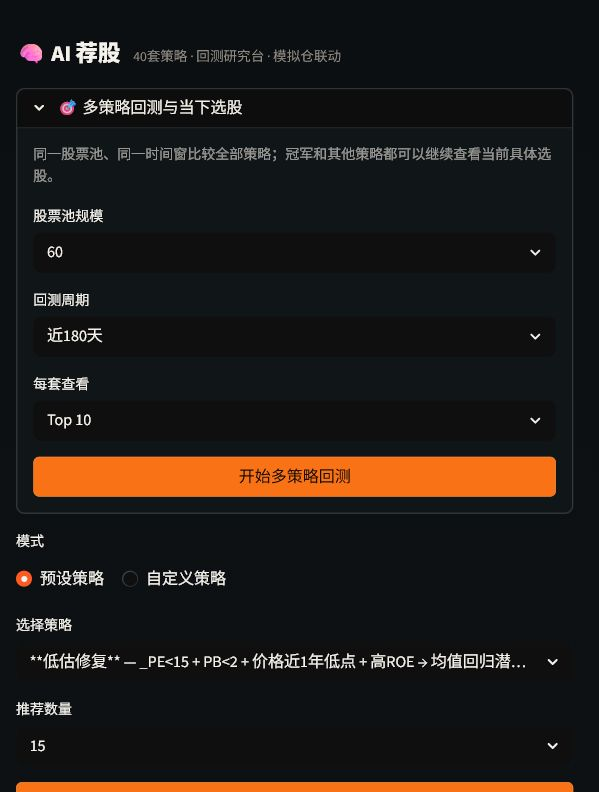
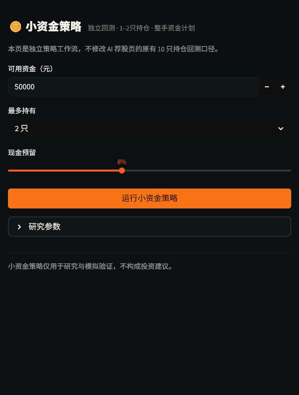
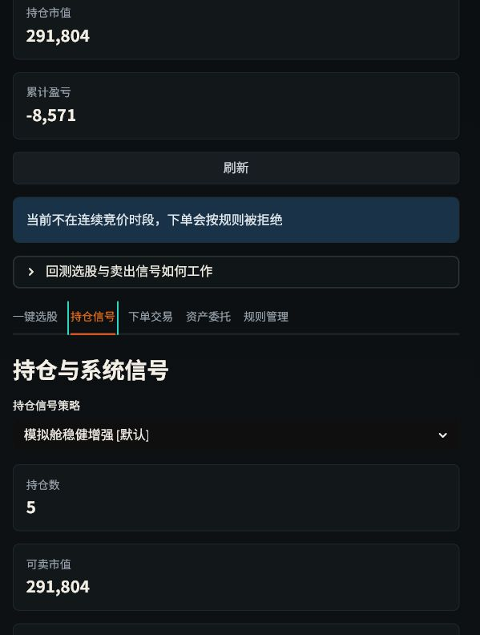
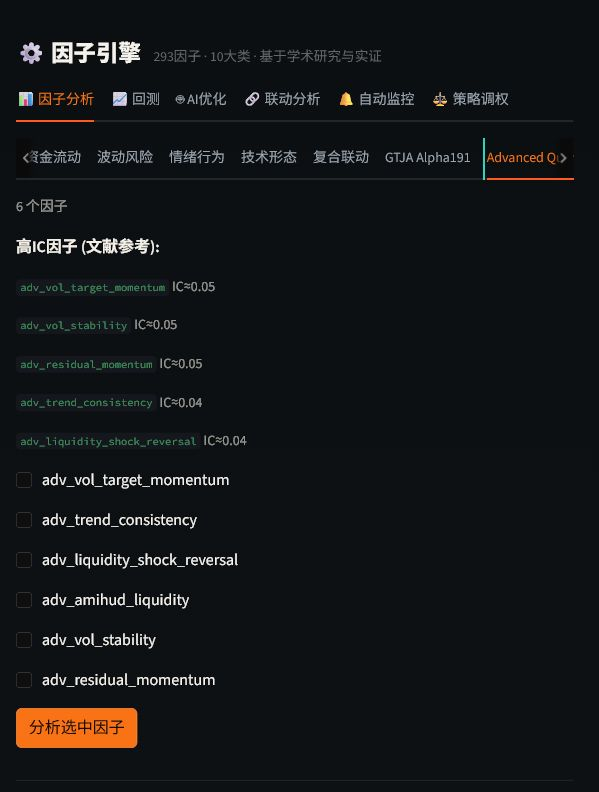

# TradingAgents-Astock

## 把 A 股研究，从“一个分数”变成一条可检查的决策链

TradingAgents-Astock 是面向 A 股的开源多 Agent 投研与量化研究工作台。它把 7 类分析角色、293 个因子、40 套策略、回测比较、当前信号和模拟交易放在同一套界面中，让每一步都能继续追问：为什么入选、由哪些策略支持、买得起几手、什么时候减仓、数据哪里不足。



## 这次新增了什么

- 独立小资金策略页：资金只够 1–2 只股票时，使用专属持仓上限、现金预留与整手计划；原 AI 荐股页保持原有 10 只持仓口径。
- 多策略共识：领先策略按排名投票，不用第二个黑箱模型覆盖原始逻辑。
- 整手买入计划：结合价格、板块手数、手续费和现金预留计算计划股数。
- 非冠军可追溯：回测后每套策略都能查看自己的当下选股。
- 持仓动作同源：止损、止盈、减仓、加仓、清仓都由统一信号生成，并受 T+1 和交易规则约束。
- 因子研究升级：支持 RankIC 周期、衰减、正交化与稳定低相关筛选。





## 不靠口号的边界

项目不承诺收益，不把短期年化当预测，不把收费数据写成“已接入”，也不把训练内准确率包装成机器学习选股能力。新闻、研报、北向历史和高频盘口缺少可靠点时数据时，会明确标注限制。

## 适合谁

- 想研究 A 股因子和策略，但不想先搭完整数据与界面的人；
- 资金规模较小，希望先验证“实际买得下”而不是只看 Top10 排名的人；
- 希望把 AI 报告、规则信号、回测和模拟仓连接起来的个人研究者；
- 需要本地部署、可审查源码和可扩展数据源的开发者。



## 开始使用

```powershell
pip install -e .
streamlit run web/app.py
```

Windows 源码用户也可以双击 `启动.bat`。详细步骤、免登录开发配置与风险说明见 [使用指南](USER_GUIDE.md)。

项目采用 Apache 2.0 协议。所有结果仅用于研究学习和模拟验证，不构成投资建议。
