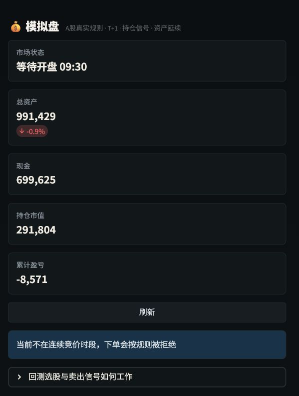

# TradingAgents-Astock 使用指南

> 面向研究与模拟交易，不构成投资建议。公开行情接口可能限流或调整，回测结果不代表未来收益。

## 1. 启动方式

### 源码启动（推荐用于开发）

```powershell
pip install -e .
streamlit run web/app.py
```

安装项目后也可以运行：

```powershell
tradingagents-web
```

默认地址是 `http://127.0.0.1:8501`。需要模型能力时，在 `.env` 中填写对应服务的 API Key；行情浏览、回测和多数规则逻辑不要求模型 Key。

### Windows 一键启动

源码目录中双击 `启动.bat` 即可。它会调用 `launcher.py`，启动本机 Streamlit 服务，等待 8501 端口可用后打开默认浏览器。也可以给 `启动.bat` 创建桌面快捷方式。

仓库还包含 `Agu.spec` 与 `scripts/build_windows.ps1`，用于构建可双击的 `TradingAgents-Astock.exe` one-folder 包：

```powershell
powershell -ExecutionPolicy Bypass -File scripts/build_windows.ps1 -Version 0.2.7
```

当前源码启动和批处理启动可用；冻结 EXE 的最终发布包仍应在干净的 Windows 构建机上验收，不能把“存在构建脚本”等同于“正式安装包已经发布”。

### 开发阶段免登录

只在本机 `.env.local` 中设置：

```env
TA_DEV_MODE=true
```

重启应用后，开发会话以本地管理员权限访问页面，不再要求登录。共享环境和生产环境必须保持 `TA_DEV_MODE=false`，并单独配置 `TA_ADMIN_USERNAME` 与 `TA_ADMIN_PASSWORD`。

## 2. 小资金多策略回测

打开“AI 荐股 → 多策略回测与当下选股”：

1. 选择股票池和回测周期。
2. 输入真实可用资金，持仓上限选 1 或 2 只，并设置现金预留。
3. 点击“开始多策略回测”。所有策略使用同一股票池、成本、调仓频率和持仓上限比较。
4. 在“冠军结果”查看单策略结果；在“策略研究台”查看所有非冠军策略及其具体选股。
5. 在“多策略共识”查看前三策略共同支持的候选和整手买入计划。


短窗口、少持仓会把年化数字显著放大，应重点看最大回撤、换手、样本外稳定性和实际整手可买性，不应把页面年化值当作收益预期。

### 共识和资金分配规则

- 共识覆盖率占 60%，各策略内部名次占 40%。
- 只保留 `BUY/WATCH` 且非高风险的候选。
- 科创板按最低 200 股评估，其他当前支持板块按 100 股评估。
- 先保证候选买得起一手，再把剩余预算逐手分给当前投入较低的持仓。
- 费用估计包含最低 5 元佣金和过户费；最终成交仍由模拟仓按实时行情复核。

## 3. 加入模拟仓与持仓管理

采用冠军、任意策略或共识候选后，点击页面下方“加入模拟仓候选”。在模拟仓“一键选股”页签确认；如果来自小资金共识，页面会显示预计投入、剩余现金和计划股数，并可按计划股数一键买入。



模拟仓卖出、加仓和清仓不是固定按钮猜测，而是统一持仓信号驱动：

- `STOP_LOSS / EXIT`：清仓全部可卖股份。
- `TAKE_PROFIT / REDUCE`：优先减约一半可卖仓位。
- `ADD`：单次建议不超过当前持仓约 25%，并按整手取整。
- `HOLD`：不生成交易委托。

T+1、交易时段、涨跌停、整手、佣金和可用现金会在下单时再次校验。


## 4. 因子研究

“因子引擎”提供 293 个因子、分类筛选、回测、IC/RankIC、相关性和策略调权入口。新增研究工具支持：

- 按指定未来交易日计算 RankIC，而不是误用输入日期的下一个采样点；
- 比较 1/5/20 日等不同周期的 IC 衰减；
- 横截面顺序正交化，去除规模、价值等线性重叠；
- 根据绝对 IC、ICIR、正向比例和相关阈值筛选稳定低相关因子。


## 5. 常见问题

**为什么共识页可能没有股票？**

前三策略当下没有同时通过买入/观察、风险和数据完整性过滤的标的。空仓也是有效结果，不应为凑数量放松规则。

**为什么回测年化很高？**

90 天等短窗口加上 1–2 只集中持仓，会产生极不稳定的年化外推。扩大时间窗、做滚动样本外验证并检查回撤和换手。

**机器学习模型在哪里？**

LightGBM、XGBoost、CatBoost 和 Random Forest 已进入研究路线，但默认依赖尚未加入。没有点时特征、时间切分和样本外验证前，不把训练内高分包装成策略。

**管理员登录不上怎么办？**

本地开发用 `.env.local` 的 `TA_DEV_MODE=true`。正式管理员登录需要同时配置 `TA_ADMIN_USERNAME` 与 `TA_ADMIN_PASSWORD`，修改后重启应用。

更多候选策略、数据约束和优先级见 [量化研究路线图](QUANT_RESEARCH_ROADMAP.md)。
